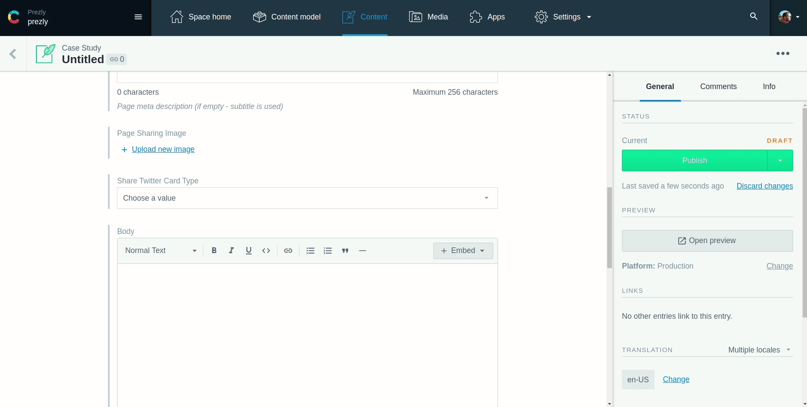

# Uploadcare extension for Contentful CMS

Use Uploadcare images for Contentful image fields



Brought to you with ❤️ by [Prezly](https://www.prezly.com/?utm_source=github&utm_campaign=uploadcare-extension-for-contentful).


## Requirements

The extension code is written using modern JS features (async/await syntax) and does not have transpilation to simplify reviewing final code before installing it to Contentful. This means **this extension will only work in modern "evergreen" browsers** (Chromium 55+ and derivatives, Edge 15+, Firefox 52+, Opera 42+, Safari 10.1+).


## Installation

1. Make sure you have an [Uploadcare](https://uploadcare.com/) subscription.

2. Go to *Settings* > *Extensions* in your Contentful space dashboard.

3. Install *Uploadcare Image Dialog* Extension:

   - Click *Add extension* > *Install from GitHub*
   - Paste the link below:
     ```
     https://github.com/prezly/uploadcare-extension-for-contentful/blob/master/uploadcare-image-dialog/extension.json
     ```
   - Click *Install*
   - When you the extension page, scroll down and provide *Uploadcare Public Key*
   - Click *Save*
   
4. Install *Uploadcare Image Field* Extension:

   - Click *Add extension* > *Install from GitHub*
   - Paste the link below:
    ```
    https://github.com/prezly/uploadcare-extension-for-contentful/blob/master/uploadcare-image-field/extension.json
    ```
   - Click *Install*
   - When you the extension page, scroll down and provide *Dialog Extension ID*.
     You can get it from page URL, when you open *Uploadcare Image Dialog* extension for editing.
   - Click *Save*

5. Add image fields to your content types model.  
   
   - Go to *Content model*
   - Select a content type
   - Click *Add field*, select *JSON Object*
   - Name it, click *Create and configure*
   - Go to *Appearance* tab, select *Uploadcare Image Field* extension
   - Click *Save*
    
6. Now you can add Uploadcare images to your Contentful entries.

7. Remember to implement rendering for Uploadcare JSON images on your website.

8. Enjoy!


## Share the awesomeness

If you like this library, please share a link to this page on Twitter. :) 
